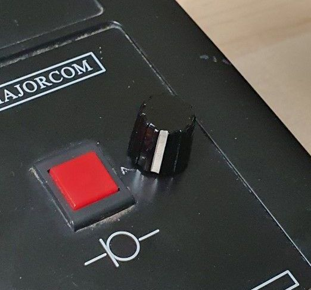

# CbRadioRotaryChannelSelector
## DIY Rotary Channel Selector for a CB (Citizen Band) Radio embedded into a stand microphone.
[Small YouTube Demo](https://youtu.be/qo1N41HTzeY)

# Preface
The channel switching on the vast majority of the modern CB radios is implemented by the channel up/down buttons on the device itself and on the handheld microphone. 

For the stationary use you can replace the handheld by a stand microphone providing a better user experience but you still have to switch channels by pressing the buttons which is not so convenient in compare to switching the channels using a rotary knob like in old devices.

So the idea of this project was born to extend a stand microphone with a rotary channel switch. The switch shall mimic the up/down buttons behavior so it can be connected the same way as the up/down buttons of the handheld microphone.
 
There is no rotary switches on the market providing the direct conversion of the left/right rotary movement into the down/up signals.

The most of the rotary switches on the market are [incremental encoder](https://en.wikipedia.org/wiki/Incremental_encoder), so a conversion functionality is necessary.

This conversion can be implemented either as code in a controller (for example ESP8266/ESP32) or as pure electronic.

Although I have experience with ESPs an there are ready to use libraries for this I found the electronic solution more suitable for the purpose and more interesting to implement.

The electronic circuit I developed is based on the [answer in the electronic stack exchange](https://electronics.stackexchange.com/a/290684)

# Circuit Diagram

# Implementation Pictures

